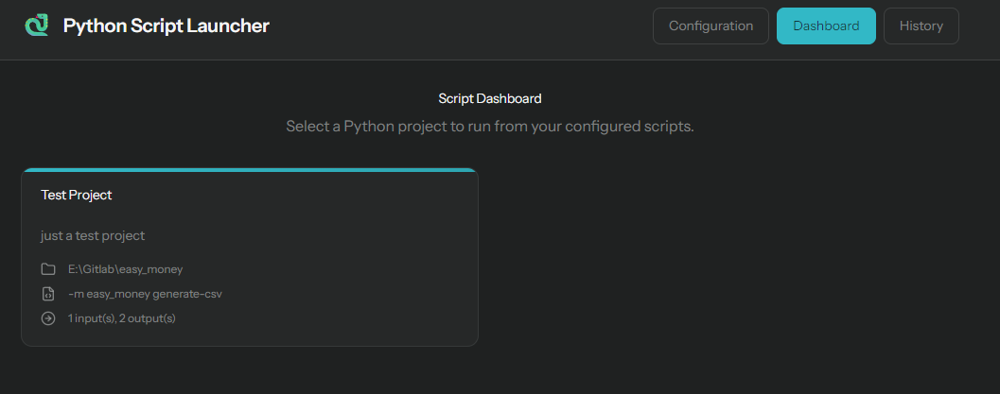

# Python CLI Web Runner 🚀

> Transform your Python CLI tools into accessible web applications without creating custom UIs for each one.

## 📖 Overview

Python CLI Web Runner is a web application that allows you to run your existing Python CLI tools through a clean web interface. Perfect for Quality of Life (QOL) tools that you want to access across multiple devices without the hassle of setting up individual UIs.

### ✨ Key Features

- **🔧 Zero UI Development**: Use your existing CLI tools without creating custom interfaces
- **🌐 Cross-Device Access**: Access your tools from any device through a web browser
- **📁 File Management**: Upload files as inputs and download generated outputs
- **⚡ Real-time Execution**: Live output streaming during script execution
- **🔒 Workspace Isolation**: Each execution runs in its own isolated workspace
- **📋 YAML Configuration**: Simple configuration system for adding new projects

## 🏗️ Architecture

Built with modern web technologies:
- **Backend**: [AdonisJS](https://adonisjs.com/) - Node.js MVC framework
- **Frontend**: [React](https://reactjs.org/) with [Inertia.js](https://inertiajs.com/) for seamless SPA experience
- **Database**: SQLite (configurable)
- **Python Integration**: Virtual environment isolation

## 🚀 Quick Start

### Prerequisites

- Node.js (≥16.0.0)
- Python 3.x with venv support
- Your Python CLI projects with valid `.venv` folders

### Installation

1. **Clone the repository**
   ```bash
   git clone https://github.com/mathisschmidt/python-script-launcher.git
   cd python-cli-web-runner
   ```

2. **Build the application**
   ```bash
   npm run build
   ```

3. **Configure environment**
   ```bash
   cp .env.example .env
   # Edit .env and set NODE_ENV=production
   ```

4. **Install dependencies and setup database**
   ```bash
   cd build/
   npm ci --omit="dev"
   node ace migration:refresh
   ```

5. **Start the server**
   ```bash
   node bin/server.js
   ```

The application will be available at `http://localhost:3333` (or your configured port).

## ⚙️ Configuration

Add your Python projects by configuring them through the web interface using YAML format:

```yaml
projects:
  - name: "Data Processing Tool"
    description: "Processes CSV files and generates reports"
    inputs:
      - name: "input_file"
        description: "CSV file to process"
        required: true
        type: file
        multiple: false
      - name: "-verbose"
        description: "Enable verbose output"
        required: false
        type: text
        defaultValue: "-v"
    path: "/path/to/your/python/project"
    scriptName: "main.py"
    outputs:
      - "report.pdf"
      - "summary.csv"
```

### Configuration Schema

| Field | Type | Description |
|-------|------|-------------|
| `name` | string | Display name for the project |
| `description` | string | Brief description of what the tool does |
| `inputs` | array | Input parameters (arguments and options) |
| `path` | string | Absolute path to your Python project |
| `scriptName` | string | Script/command to execute |
| `outputs` | array | Expected output files to make downloadable |

## 🔒 Security Considerations

> ⚠️ **Important Security Notice**: This tool can execute arbitrary Python scripts on your server. Always implement proper security measures:

- **Authentication Required**: Use a reverse proxy (nginx, Apache) with authentication
- **Network Isolation**: Run in a restricted network environment
- **User Permissions**: Run with minimal system permissions
- **Regular Monitoring**: Monitor execution logs and system resources

### Recommended Nginx Configuration

```nginx
server {
    listen 80;
    server_name your-domain.com;
    
    auth_basic "Restricted Access";
    auth_basic_user_file /etc/nginx/.htpasswd;
    
    location / {
        proxy_pass http://localhost:3333;
        proxy_set_header Host $host;
        proxy_set_header X-Real-IP $remote_addr;
    }
}
```

## 🛠️ Local Development Setup

```bash
# Install dependencies
npm install

# Run in development mode
npm run dev

# Run tests (when available)
npm test
```

## 📋 Roadmap

### 🎯 Planned Features
- Global feat
  - [ ] Configuration page
    - [ ] Use the validation part for show all error if validation failed
  - [ ] improve download system. Instead of give the output file just give possibility to download all the files in the workspace
  - [ ] Add a history for get result of the execution
    - [ ] The history can be incomplete if the workspace doesn't exist anymore.
  - [ ] Add more input type
    - [ ] boolean for give -vvv for example
    - [ ] option list

- UI
  - [ ] form should be blocked when we run the execution
  - [ ] The form button should just be blocked, we have the progress with indicator

- Optimisation
  - [ ]We don't use all the power of inertia. Inertia allow us to do almost all the render in server side. But we use axios for get new data (easier way bc my knowledge). We can probably update this and use more feature of inertia
    - [ ] Usepage -> get props given by inertia when rendered, so maybe can be useful for give data to all even children
    - [ ] Use feature of inertia for get the rendered front with new data (new messages of output as example) and let inertia replace what change etc. Very more powerful than to let the client do it with the axios request. Everything will be rendered by the client.
  - [ ] Add all the SQL reverse protection in all the request

### 🐛 Known Issues
- [ ] Character encoding issues with some outputs
- [ ] when execution error, still propose output even if not generated
- [ ] drag and drop files is not working

### 🧹 Clean
- [ ] rename scriptPath to cmd or something like that

## 🤝 Contributing

Contributions are welcome! Please feel free to submit a Pull Request. For major changes, please open an issue first to discuss what you would like to change.

1. Fork the repository
2. Create your feature branch (`git checkout -b feature/AmazingFeature`)
3. Commit your changes (`git commit -m 'Add some AmazingFeature'`)
4. Push to the branch (`git push origin feature/AmazingFeature`)
5. Open a Pull Request

## 📄 License

This project is licensed under the GPLv3 License - see the [LICENSE](readme_ressources/LICENSE.md) file for details.

## 📧 Support

If you have any questions or need help, please:
- Open an issue on [GitHub Issues](https://github.com/mathisschmidt/python-script-launcher/issues)
---

<div align="center">
  <p>Made with ❤️ for developers who love automation</p>
  <p>
    <a href="https://github.com/mathisschmidt/python-script-launcher/stargazers">⭐ Star this project</a> •
    <a href="https://github.com/mathisschmidt/python-script-launcher/issues">🐛 Report Bug</a> •
    <a href="https://github.com/mathisschmidt/python-script-launcher/issues">💡 Request Feature</a>
  </p>
</div>
